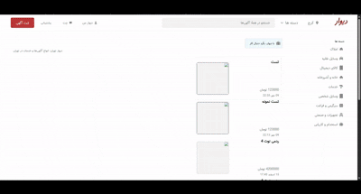

# 📌 Divar Clone Backend (Express + MongoDB + Swagger + EJS)

This project is a backend clone of **Divar**, a classified ads platform.  
It includes user authentication, ad management, categories, image uploads, and API documentation using Swagger.  
A simple frontend layer is implemented using **EJS** for server-side rendering.

---

## 🎥 Demo

<p align="center">
  
</p>

---

## 🚀 Features

- 🔐 JWT Authentication
- 📦 Create, Edit, Delete Posts
- 👤 User Management
- 🗂 Categorized Advertisements
- 📁 Image Upload (Multer)
- 📝 Swagger API Documentation
- 🎨 Simple Frontend using EJS

---

## 🧰 Tech Stack

| Category    | Tools             |
| ----------- | ----------------- |
| Backend     | Node.js, Express  |
| Database    | MongoDB, Mongoose |
| Frontend    | EJS, Bootstrap    |
| Auth        | JWT, bcrypt       |
| File Upload | Multer            |
| Docs        | Swagger, OpenAPI  |

---

## 📦 Installation & Setup

```bash
# Clone repository
git clone https://github.com/mohammadjavad-gorgani/divar.git

# Enter project folder
cd divar

# Install dependencies
npm install

# Run the project
npm start

📚 API Documentation (Swagger)
After running the project, Swagger is available at:

http://localhost:3400/swagger

📄 Swagger UI Preview:


📁 Project Structure
📦 divar
├── 📁 public
├── 📁 views
├── 📁 src
│   ├── common
│   ├── config
│   ├── models
│   └── app.routes.js
├── .env
├── package.json
├── main.js
└── README.md


```
